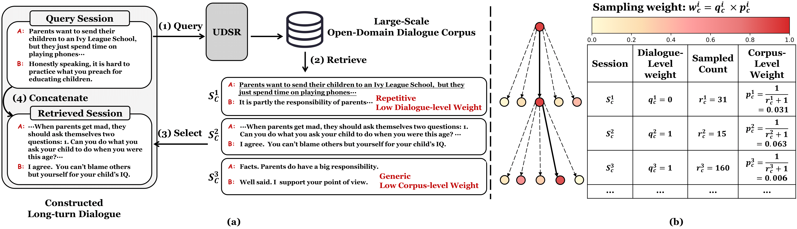

# Re3Dial: Retrieve, Reorganize and Rescale Conversations for Long-Turn Open-Domain Dialogue Pre-training

This repository contains data, code, and pre-trained retriever models for our EMNLP 2023 paper
> [Re$^3$Dial: Retrieve, Reorganize and Rescale Conversations for Long-Turn Open-Domain Dialogue Pre-training](https://arxiv.org/abs/2305.02606)

In this work, we propose Re$^3$Dial (Retriever, Reorganize, and Rescale), a framework to automatically construct billion-scale long-turn dialogues by reorganizing existing short-turn ones.




### Getting Started

```python
from transformers import BertTokenizer, BertModel
import torch


def get_embedding(encoder, inputs):
    outputs = encoder(**inputs)
    pooled_output = outputs[0][:, 0, :]
    return pooled_output

tokenizer = BertTokenizer.from_pretrained('')
tokenizer.add_tokens(['<uttsep>'])
query_encoder = BertModel.from_pretrained('')
context_encoder = BertModel.from_pretrained('')

query = '你好<uttsep>好久不见，最近在干嘛'
context = '正在准备考试<uttsep>是什么考试呀，很辛苦吧'

query_inputs = tokenizer([query], return_tensors='pt')
context_inputs = tokenizer([context], return_tensors='pt')

query_embedding = get_embedding(query_encoder, query_inputs)
context_embedding = get_embedding(context_encoder, context_inputs)

score = torch.cosine_similarity(query_embedding, context_embedding, dim=1)

print('similarity score = ', score)
```

### 1. Install

```
conda create -n redial python=3.8
pip install -r requirements.txt
```

### 2. Prepare Original Dialogue Corpus

- each line is a multi-turn dialogue seperated by `\t`
- for example: 'u1\tu2\tu3\tu4'

### 3. Construct Long-turn Dialogue Corpus

Before running the code, please change some arguments (e.g., the path of pre-trained models, data path, save path) in the script according to your own path.

#### 3.1 Training and Inference of UDSR

- train

```bash
cd src
bash scripts/train.sh 8 # 8 means data-parallel training over 8 GPUs
```

- inference

```bash
cd src
bash scripts/predict.sh 8 # 8 means data-parallel inference over 8 GPUs
```

#### 3.2 Retrieval

- retrieval on a single GPU

```bash
cd src
bash scripts/retrieve.sh
```

- data-parallel retrieval over multi-GPUs

```bash
cd src
python scripts/parallel_retrieve.py
```

#### 3.3 Build Long-turn Dialogue Corpus

```bash
cd src
bash scripts/build_corpus.sh
```

### 4. Citation

```
@article{wen2023re,
  title={Re $\^{} 3$ Dial: Retrieve, Reorganize and Rescale Dialogue Corpus for Long-Turn Open-Domain Dialogue Pre-training},
  author={Wen, Jiaxin and Zhou, Hao and Guan, Jian and Huang, Minlie},
  journal={arXiv preprint arXiv:2305.02606},
  year={2023}
}
```
